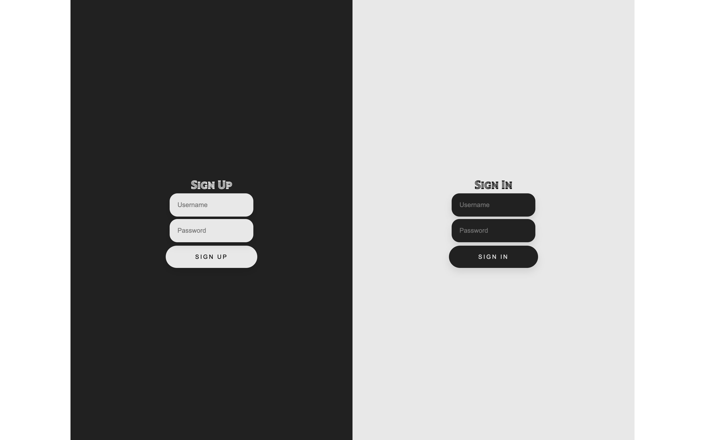

# Login Page

This is the login page for our website. The login page is an essential part of any website that requires user authentication.

## Overview

The login page is the first page that a user encounters when they attempt to access a protected area of our website. This page allows users to enter their login credentials, which are then verified against our user database. Once the user is authenticated, they are granted access to the protected area of the website.

## Functionality

The login page has one key feature:

- Username and password fields: Users are prompted to enter their username and password in order to log in.

## Design

The login page should be designed to be simple and intuitive for users. It should include clear and concise instructions on how to log in, as well as any relevant error messages. The page should also be visually appealing and consistent with the overall design of the website.

Here's an example screenshot of a login page design that follows these guidelines:

## Conclusion

The login page is an essential component of any website that requires user authentication. It should be designed to be simple, intuitive, and user-friendly. By following these guidelines, we can ensure that our users are able to log in easily and efficiently.
